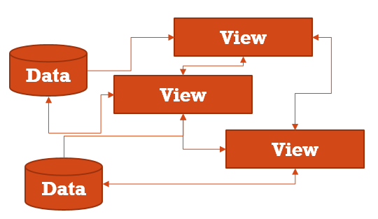
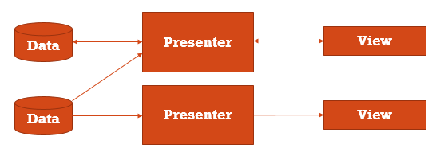
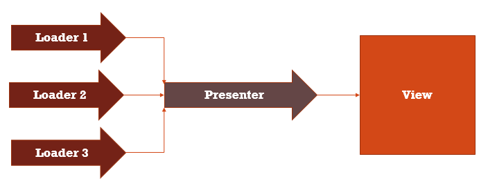
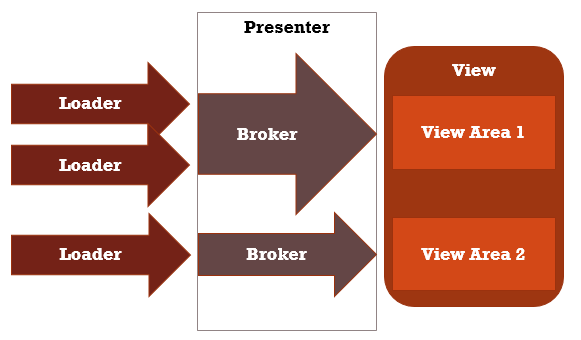

### The Model-View-Presenter pattern

* **View** is a layer that displays data and reacts to user actions.
On Android, this could be Activity or android.view.View.
* **Model** is a data access layer such as database API or remote server API.
* **Presenter** is a layer that provides View with data from Model.
Presenter is doing job related to background tasks and data changes.


More on MVP you can find at
[Wikipedia: Model-View-Presenter](http://en.wikipedia.org/wiki/Model%E2%80%93view%E2%80%93presenter)

### Inspiration

[Advocating Against Android Fragments](http://corner.squareup.com/2014/10/advocating-against-android-fragments.html)

[Mortar](https://github.com/square/mortar)

[Keep It Stupid Simple](http://people.apache.org/~fhanik/kiss.html)

# Problem

* Android development is View-centric
* View cannot be considered as a point of stability for an application because of its nonpermanent nature
* Most of the modern Android applications just use View-Model architecture
* Programmers are involved into fight with View complexities instead of solving business tasks

Using only Model-View in your application you usually end up with "everything is connected with everything".



If this diagram does not look complex, then think about each arrow shows asynchronous data transfer. Each View 
can disappear and appear at random time. Do not forget about saving/restoring of Views.
Attach a couple of background threads to that nonpermanent Views, and the cake is ready!

An alternative to the "everything is connected with everything" is a god object.


A god object is overcomplicated; its parts cannot be reused, tested or easily refactored.

# Solution: MVC



* Background tasks persist despite of configuration changes (don't have to check if such task is already running,
no double task runs, no memory leaks - all happens naturally)
* Complex tasks are split into simpler tasks and are easier to solve
* Less code, less bugs, easier to debug
* Testable

# Simplicity

During the development of Nucleus the primary goal was to create an MVP solution 
for Android with "Keep It Stupid Simple" in mind.
There are about 15Kb of `nucleus.jar` that do all the job.
(0.2 update: it is 29Kb now but now we have RxJava support!)

If you are familiar with Mortar, you will find a lot of common.
However, Nucleus requires you to write less code. You can use Dagger for your dependencies,
but it is not used for instantiating a Presenter.

One of the shining features of Nucleus is its Model part of the MVP.
Other MVP solutions are, in fact 'View-Presenter', and leave Presenter without support from the backside.

### Hello world

    public class MainActivity extends NucleusActivity<MainPresenter> {
        @Override
        protected PresenterCreator<MainPresenter> getPresenterCreator() {
            return new PresenterCreator<MainPresenter>() {
                @Override
                public MainPresenter createPresenter() {
                    return new MainPresenter();
                }
            };
        }
    }

    public class MainPresenter extends Presenter<MainActivity> {
        @Override
        protected void onTakeView(MainActivity view) {
            view.setTitle("Hello, MVP world!");
        }
    }

If you care about your existing Activity class tree - you don't need to use
NucleusActivity class, just copy-paste NucleusActivity's code.

### Loader

Loader is a simple class that provides a Presenter with data when the data is available. 
It implements [Observer](http://en.wikipedia.org/wiki/Observer_pattern) and
[Adapter](http://en.wikipedia.org/wiki/Adapter_pattern) patterns at the same time.
It adopts different ways of getting data (database API, network API, cache API etc.) to fit
Nucleus and Android components' lifecycle.

    public abstract class Loader<ResultType> {

        public interface Receiver<ResultType> {
            void onLoadComplete(Loader<ResultType> loader, ResultType data);
        }

        public void register(Receiver<ResultType> receiver);
        public void unregister(Receiver<ResultType> receiver);
        protected void notifyReceivers(ResultType data);
    }

A typical Nucleus application subclasses Loader at least once. Subclassing Loader allows 
to avoid a boilerplate code in the future. 
Example: [RetrofitLoader](https://github.com/konmik/nucleus/blob/master/nucleus-example/src/main/java/nucleus/example/network/RetrofitLoader.java).

It is also possible to use RxJava for Model, see below.

# Complexity

**A complex task requires a complex solution... or not?**

Most of the time you just need to pass some data from a Model to a View, making a couple of 
checks and preparations for the View to make it completely Model-independent. 

You don't want to deal with registering/unregistering to loaders,
you don't want to check if a view exists or it is being recreated right now,
you don't want to check if data from all required loaders is ready to be presented, etc.
All of these are typical tasks. 

To be short: you don't want to create a boilerplate code.
So here is LoadBroker class that will do all of that for you.

* **Broker** is used to connect a Presenter with a View.
* **LoadBroker** is used to connect a Model with a View.

You can think of Broker as a helping class inside of Presenter.

### LoadBroker



* **Loader** - Just passes data when data is available
* **View** - Just shows data
* **Presenter** - Registers to loaders, publishes data when all data from loaders is available and a view is available.
Re-publishes data when the view has been recreated or when new data is available from loaders.

How complex the Presenter's code should be?

    public class MainPresenter extends Presenter<MainActivity> {
        @Override
        public void onCreate(Bundle savedState) {
            addViewBroker(new LoaderBroker<MainActivity>(itemsLoader) {
                @Override
                protected void onPresent(MainActivity view) {
                    view.publishItems(getData(itemsLoader));
                }
            });
        }
    }

**LoadBroker** does all register/unregister job for you.



RxJava variant:

    public class MainPresenter extends RxPresenter<MainActivity> {
        @Override
        public void onCreate(Bundle savedState) {
            addRxViewBroker(items.load(), new Action2<List<Item>, MainActivity>() {
                @Override
                public void call(List<Item> items, MainActivity view) {
                    view.publishItems(items);
                }
            });
        }
    }

### Custom presenter's typical lifecycle

Sometimes it is not enough just to publish data.

    public class MyPresenter extends Presenter<ViewType> {
        @Override
        protected void onCreate(Bundle savedState) {
            // initialize the presenter, start background tasks
        }

        @Override
        protected void onTakeView(ViewType view) {
            // publish some data when a view is attached to the presenter.
        }

        // Use getView() to check availability of the view when receiving a background task result.

        @Override
        protected void onDestroy() {
            // free resources, unregister and cancel background tasks when a user exits the view
        }
    }

# More Features

* **Nested, reusable presenters** - you can reuse your MVP-driven Views in different application areas,
just override parent presenter's onTakePresenter instead of onTakeView if you need to take control over
the nested presenter. Alternatively, use Presenter.addPresenterBroker.

* **Smart save/restore** - Presenter gets its view AFTER the view has been completely restored 
and attached to an Activity. This allows to use View's ability to save and restore its state. 
It is also extremely useful when dealing with user input such as EditText.

# How to use

* Maven dependency:
```
<dependencies>
    <dependency>
        <groupId>info.android15.nucleus</groupId>
        <artifactId>nucleus</artifactId>
        <version>0.2</version>
    </dependency>
</dependencies>
```

* Gradle dependency:

```
dependencies {
    compile 'info.android15.nucleus:nucleus:0.2'
}
```

### Compiled example

* [nucleus-example-0.2.apk](https://repo1.maven.org/maven2/info/android15/nucleus/nucleus-example/0.2/nucleus-example-0.2.apk)

# Future releases

* Additional tests
* Improved example

# Feel free to contact me

sirstripy-at-gmail.com
